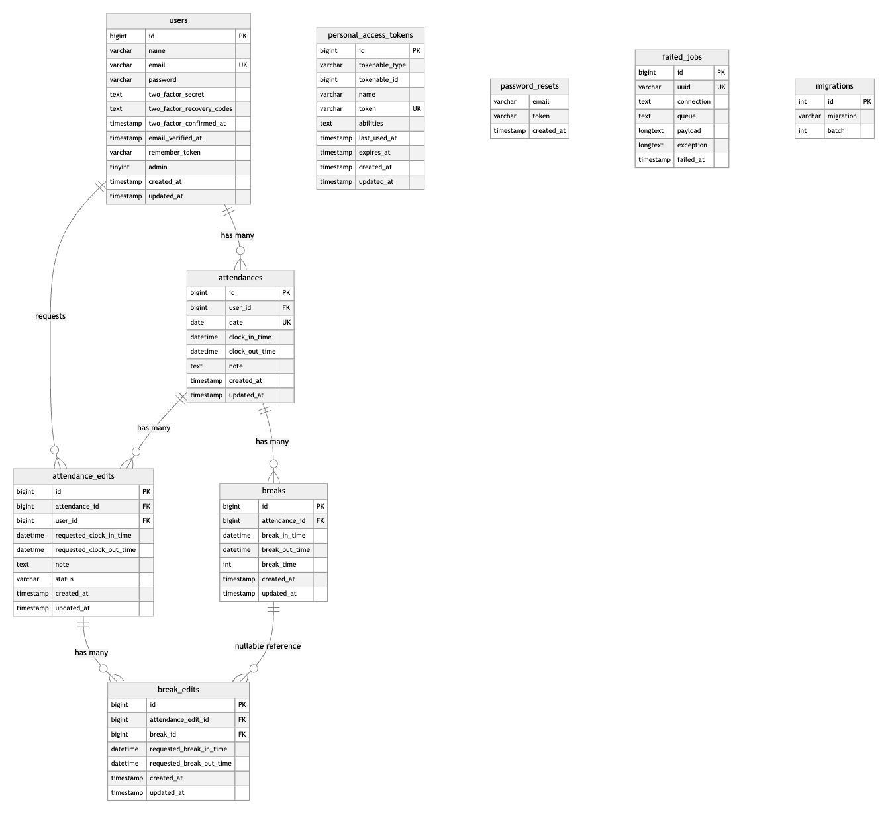

# 勤怠管理アプリ

## 概要

一般ユーザーが出勤・休憩・退勤の打刻を行い、管理者が勤怠情報や修正申請を確認・承認できる勤怠管理アプリです。

Laravel Fortifyによる認証、メール認証、管理者ログイン、勤怠修正申請、APIによる勤怠データ操作に対応しています。

---

## リポジトリ

git@github.com:pekotarou/Attendance_management_2026_07.git

---

## 使用技術

- PHP 8.1
- Laravel 8
- MySQL 8.0
- Nginx
- Docker / Docker Compose
- Laravel Fortify
- Laravel Sanctum
- MailHog

---

## 環境構築

### 1. リポジトリをクローン

```bash
git clone git@github.com:pekotarou/Attendance_management_2026_07.git
cd Attendance_management_2026_07
```

### 2. Dockerコンテナを起動

```bash
docker compose up -d --build
```

### 3. PHPコンテナに入る

```bash
docker compose exec php bash
```

### 4. パッケージをインストール

```bash
composer install
```

### 5. .env を作成・編集

```bash
cp .env.example .env
```

`.env` に以下の環境変数を設定してください。

```env
APP_NAME=Laravel
APP_ENV=local
APP_KEY=
APP_DEBUG=true
APP_URL=http://localhost

DB_CONNECTION=mysql
DB_HOST=mysql
DB_PORT=3306
DB_DATABASE=laravel_db
DB_USERNAME=laravel_user
DB_PASSWORD=laravel_pass

MAIL_MAILER=smtp
MAIL_HOST=mailhog
MAIL_PORT=1025
MAIL_USERNAME=null
MAIL_PASSWORD=null
MAIL_ENCRYPTION=null
MAIL_FROM_ADDRESS=test@example.com
MAIL_FROM_NAME="${APP_NAME}"
```

### 6. アプリケーションキーを作成

```bash
php artisan key:generate
```

### 7. マイグレーション・シーディング

```bash
php artisan migrate:fresh --seed
```

---

## URL

| 内容 | URL |
|---|---|
| 一般ユーザーログイン | http://localhost/login |
| 一般ユーザー会員登録 | http://localhost/register |
| 勤怠登録画面 | http://localhost/attendance |
| 管理者ログイン | http://localhost/admin/login |
| phpMyAdmin | http://localhost:8080 |
| MailHog | http://localhost:8025 |

---

## 使用方法

### 一般ユーザー向け

1. 会員登録画面からユーザー登録を行います。
2. 登録後、メール認証を行います。
3. ログイン後、勤怠登録画面で出勤・休憩開始・休憩終了・退勤を打刻します。
4. 勤怠一覧画面で月ごとの勤怠を確認できます。
5. 勤怠詳細画面から、出勤時間・退勤時間・休憩時間の修正申請ができます。
6. 申請一覧画面で、承認待ち・承認済みの申請状況を確認できます。
7. マイ勤怠レポート画面で、自分の勤務時間の集計を確認できます。

### 管理者向け

1. 管理者ログイン画面からログインします。
2. 勤怠一覧画面で、日付ごとの全ユーザーの勤怠を確認できます。
3. 勤怠詳細画面で、各ユーザーの勤怠内容を確認・修正できます。
4. スタッフ一覧画面で、一般ユーザーの一覧を確認できます。
5. スタッフ別勤怠一覧画面で、ユーザーごとの月別勤怠を確認できます。
6. 申請一覧画面で、全ユーザーの修正申請を確認できます。
7. 修正申請承認画面で、申請内容を確認し承認できます。

---

## テストアカウント

### 管理者ユーザー

| メールアドレス | パスワード |
|---|---|
| admin@example.com | password |

### 一般ユーザー

| メールアドレス | パスワード |
|---|---|
| user@example.com | password |

---

## 主な機能

### 一般ユーザー

- 会員登録
- ログイン
- ログアウト
- メール認証
- 出勤登録
- 休憩開始
- 休憩終了
- 退勤登録
- 勤怠一覧表示
- 勤怠詳細表示
- 勤怠修正申請
- 修正申請一覧表示
- マイ勤怠レポート表示

### 管理者

- 管理者ログイン
- 勤怠一覧表示
- 勤怠詳細表示
- 勤怠修正
- スタッフ一覧表示
- スタッフ別勤怠一覧表示
- 修正申請一覧表示
- 修正申請承認

### API

- 勤怠一覧取得
- 勤怠詳細取得
- 勤怠登録
- 勤怠更新
- 勤怠削除
- APIトークン発行
- Sanctum認証
- 権限チェック

---

## API仕様

### APIトークン発行

```http
POST /api/v1/tokens
```

#### リクエスト例

```json
{
  "email": "user@example.com",
  "password": "password"
}
```

#### レスポンス例

```json
{
  "token": "1|xxxxxxxxxxxxxxxxxxxxxxxx"
}
```

---

### 勤怠一覧取得

```http
GET /api/v1/attendance-records
```

認証は不要です。

#### クエリパラメータ

| パラメータ | 内容 |
|---|---|
| user_id | ユーザーIDで絞り込み |
| date | 日付で絞り込み |
| month | 月で絞り込み |
| per_page | 1ページあたりの件数 |

---

### 勤怠詳細取得

```http
GET /api/v1/attendance-records/{id}
```

認証は不要です。

---

### 勤怠登録

```http
POST /api/v1/attendance-records
```

認証が必要です。

#### リクエスト例

```json
{
  "user_id": 1,
  "date": "2026-07-11",
  "clock_in": "09:00:00",
  "clock_out": "18:00:00",
  "comment": "API登録テスト"
}
```
※ user_id は実際に登録されている一般ユーザーのIDを指定してください。

---

### 勤怠更新

```http
PUT /api/v1/attendance-records/{id}
PATCH /api/v1/attendance-records/{id}
```

認証が必要です。

#### リクエスト例

```json
{
  "date": "2026-07-11",
  "clock_in": "10:00:00",
  "clock_out": "19:00:00",
  "comment": "API更新テスト"
}
```

---

### 勤怠削除

```http
DELETE /api/v1/attendance-records/{id}
```

認証が必要です。

成功時は `204 No Content` を返します。

---

## エラーレスポンス

### 401 未認証

```json
{
  "message": "Unauthenticated."
}
```

### 403 権限なし

```json
{
  "error": "この操作を実行する権限がありません。"
}
```

### 404 勤怠情報なし

```json
{
  "error": "勤怠情報が見つかりませんでした。"
}
```

### 422 バリデーションエラー

```json
{
  "message": "バリデーションエラー内容",
  "errors": {
    "date": [
      "勤怠日は必須です。"
    ]
  }
}
```

---

## テスト

以下のコマンドでテストを実行できます。

```bash
docker compose exec php php artisan test
```

実行結果：

```text
Tests: 46 passed
```

### 主なテスト内容

- 会員登録
- ログイン
- ログアウト
- メール認証制御
- 出勤登録
- 休憩登録
- 退勤登録
- 勤怠一覧
- 勤怠詳細
- 修正申請
- 管理者ログイン
- 管理者勤怠一覧
- スタッフ一覧
- 修正申請承認
- マイ勤怠レポート
- API一覧取得
- API詳細取得
- API登録
- API更新
- API削除
- API PATCH更新
- Sanctum認証
- API権限チェック

---

## データベース設計

主なテーブルは以下です。

- users
- attendances
- breaks
- attendance_edits
- break_edits
- personal_access_tokens
- password_resets
- failed_jobs
- migrations

勤怠の初回打刻データは `attendances` / `breaks` に保存します。

修正申請データは `attendance_edits` / `break_edits` に保存します。

承認後も初回打刻データは上書きせず、承認済み修正データを優先して表示します。

---

## ER図・設計資料

ER図、テーブル仕様書、基本設計書、API仕様書は要件シートに記載しています。
実装内容と設計資料の差異が出ないよう、実DBのテーブル構成・ルート定義・API仕様をもとに作成しています。


---

## 補足

開発中に確認したテストはすべて通過しています。

ログイン試行回数は、開発中のエラー文確認や動作確認をしやすくするため、1分間に30回までに設定しています。

```bash
docker compose exec php php artisan test
```

```text
Tests: 46 passed
```


